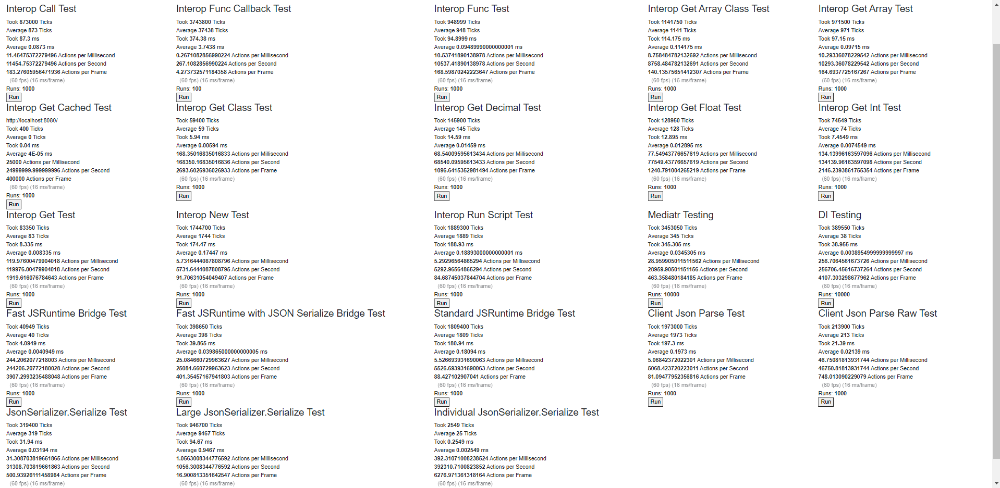
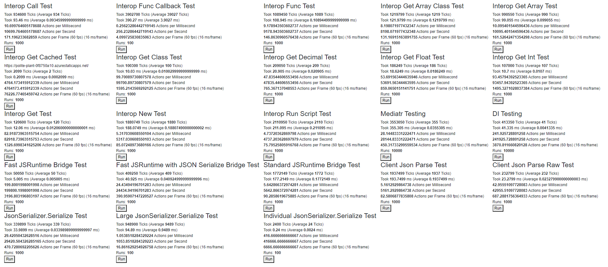
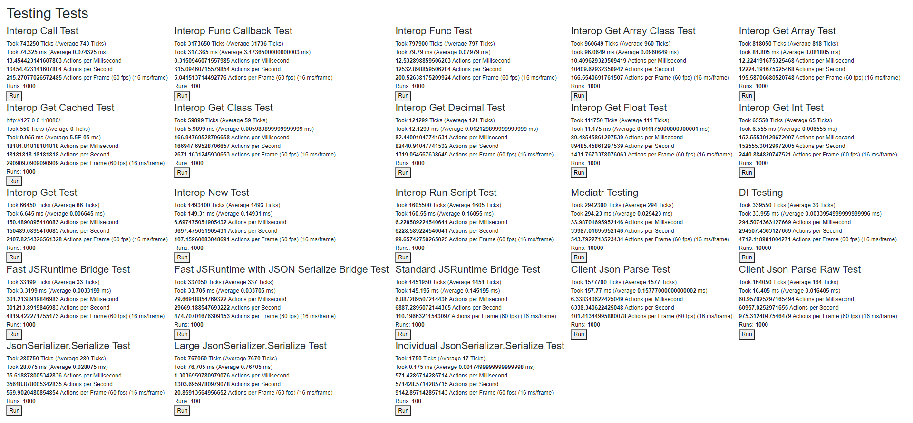
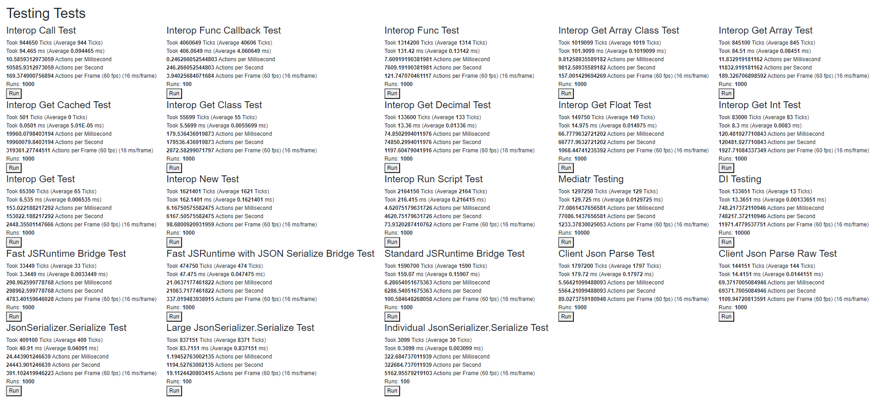

# 2020-07-30 Details

The performance drop on 2020-07-30 was specific to my computer, running the tests on the production site came up with similar numbers to the new code.

***2020-07-30_Ran_Performance_Tests-argument_callback***

***2020-07-30_Ran_Performance_Tests-deployed***

***2020-07-22_Ran_Performance_Tests-5-upgrade***

***2020-07-22_Ran_Performance_Tests***
